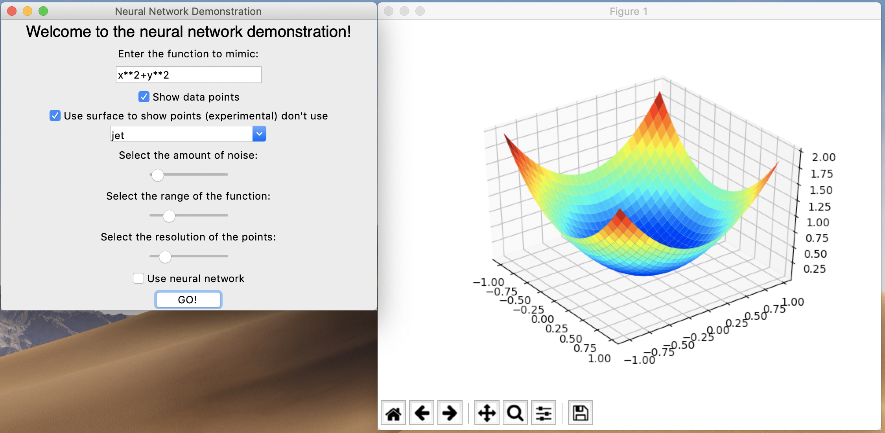
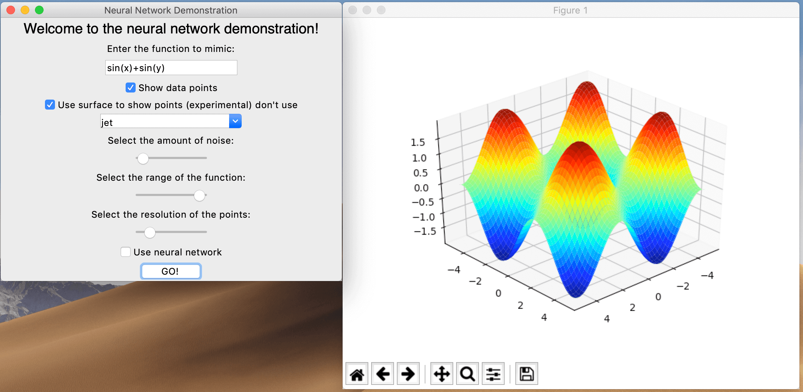
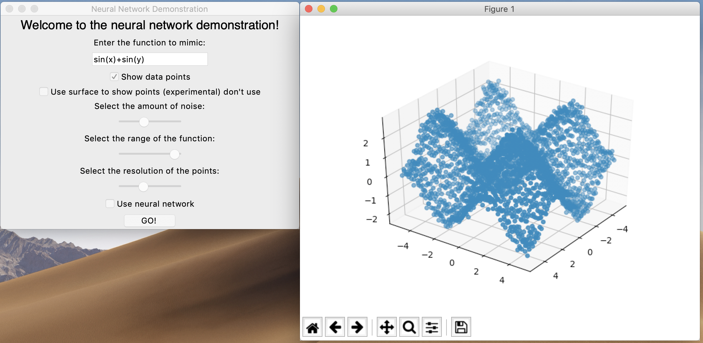
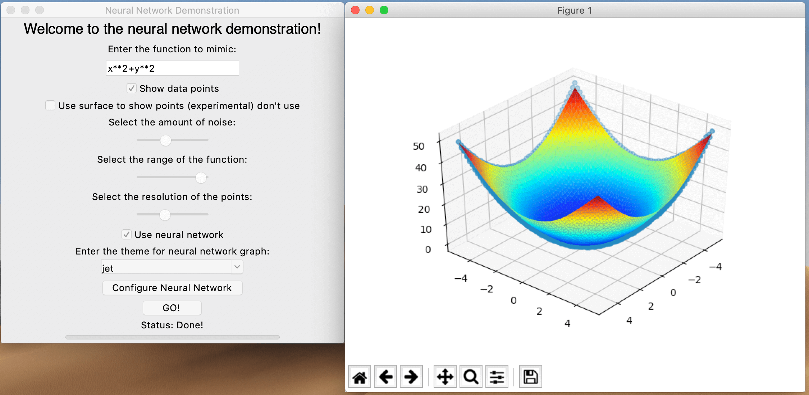
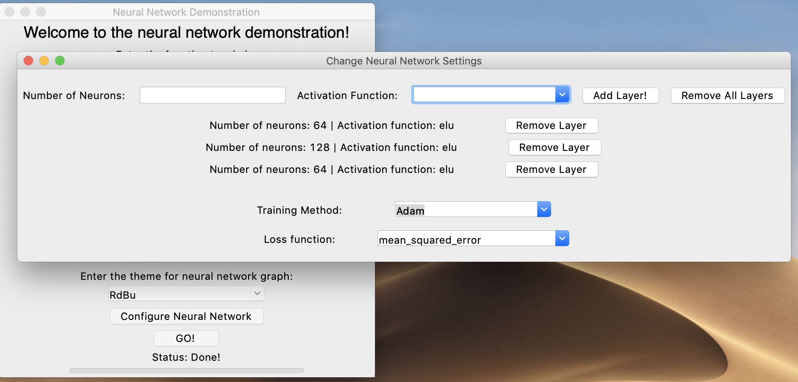
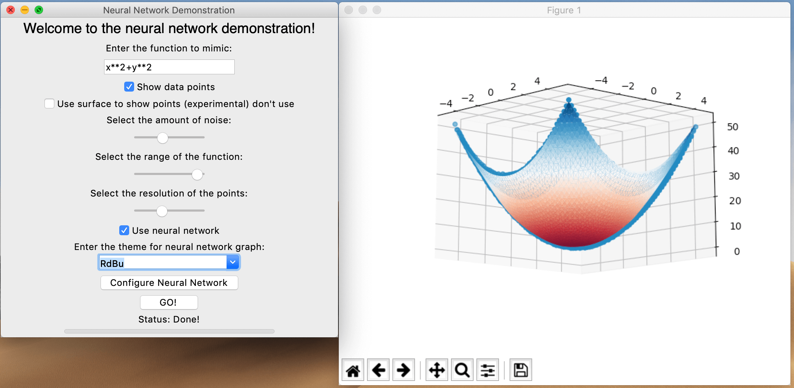

# iNNteractive
**interactive neural networks with a GUI.**

# Usage

```bash
pip3 install -r requirements.txt
python3 main.py
```

Not tested on windows, but theoretically it should work.

# Features
<table>
  <tr>
    <td width="50%" valign="top">
<h3>Data Generation</h3>
Using Numpy, the training data can be automaticaly generated given a base function. The function takes the input x and y, then manipulates the values. On the right is the graph of <code>x**2+y**2</code>. The range and the resolution of the function can be ajusted using user-friendly sliders.
    </td>
    <td>
      
    </td>
  </tr>
  <tr>
    <td width="50%">
      
    </td>
    <td valign="top">
<h3>Flexibility</h3>
The Numpy library gives this program a large amount of flexibility. Functions including sin, cos, and tan are supported. Advanced users can change the code with relative ease.
    </td>
  </tr>
<tr>
    <td width="50%" valign="top">
<h3>Create Noise In Training Data</h3>
Creating noise in training data allows more reliable and realistic results. The amount of noise can be specified.
    </td>
    <td>
      
    </td>
  </tr>
  <tr>
    <td width="50%">
      
    </td>
    <td valign="top">
<h3>Overlay Training Data With Neural Network Prediction</h3>
This feature allows the output from the neural network and the real function to be compared easily.
    </td>
  </tr>

<tr>
    <td width="50%" valign="top">
<h3>Control The Neural Network</h3>
With some Keras magic, the structure of the neural network, the activation function, its training method, and its error function can be changed and set. This opens up many possibilities during training.
    </td>
    <td>
      
    </td>
  </tr>
  <tr>
    <td width="50%">
      
    </td>
    <td valign="top">
<h3>Change Theme Of Interactive Graph</h3>
With the power of MatplotLib, It is possible to change the color theme of the interactive 3D graph. This feature is useful for comparing the output of the neural network to the real function given.
    </td>
  </tr>
  <tr>
    <td width="50%" valign="top">
<h3>Built On Tools You Trust!</h3>
Programmed in Python 3, Tensorflow and Keras made by Google is the brain behind the neural network and is trusted by millions around the globe. Other libaries used include: Numpy, Matplotlib, and Tkinter.
    </td>
    <td>
      
    </td>
  </tr>
</table>


Other Features:
* An interactive graph to visualize the training data and the neural network output
* Status bar for training
* Log files


Play around with the program as it is quite intivtive to use. The syntax when entering in functions is the normal python syntax (e.g. power is `**` and there is `sin(x)`, `cos(x)`, `tan(x)`).

